# Report AMS Acta

## Documenti per tipologia

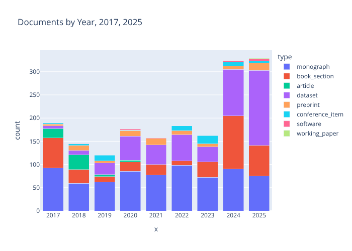

Scarica il file CSV: [documents_2017-2025.csv](documents_2017-2025.csv)

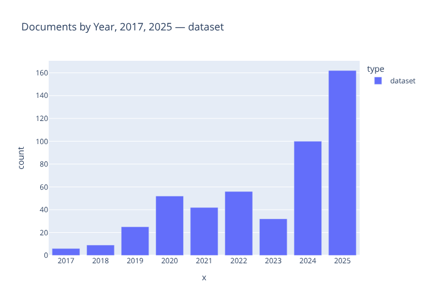

Scarica il file CSV: [documents_2017-2025_dataset.csv](documents_2017-2025_dataset.csv)

## Dataset con collegamento a pubblicazione

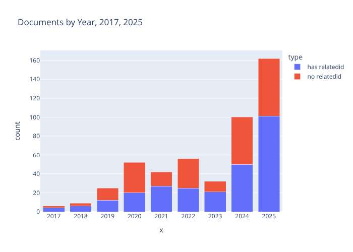

Scarica il file CSV: [relatedid_2017-2025.csv](relatedid_2017-2025.csv)

## Volume di dati

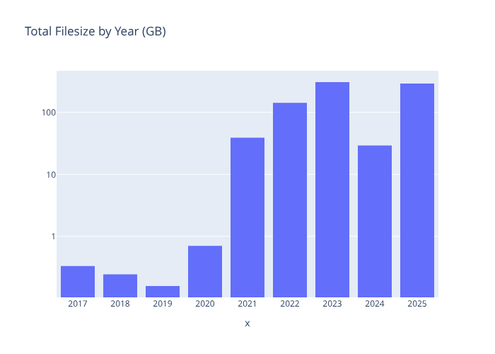

Scarica il file CSV: [sizes.csv](sizes.csv)

## Settori disciplinari

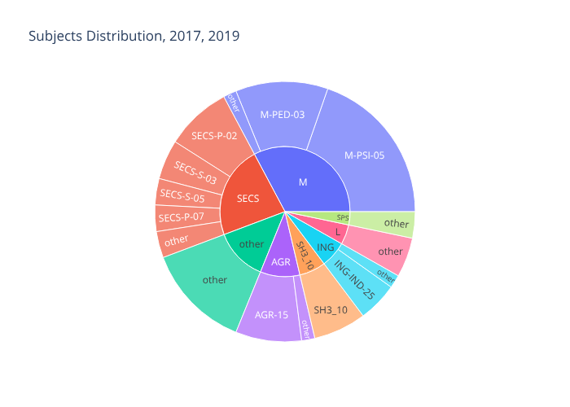

Scarica il file CSV: [subject_2017-2019.csv](subject_2017-2019.csv)

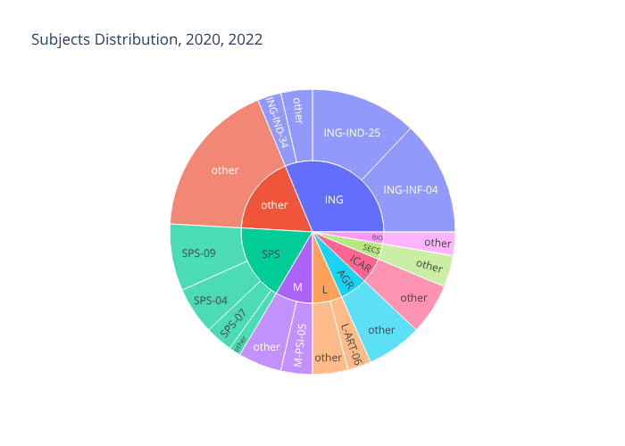

Scarica il file CSV: [subject_2020-2022.csv](subject_2020-2022.csv)

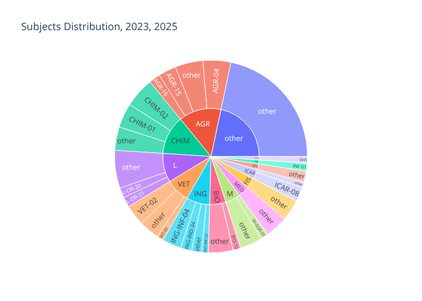

Scarica il file CSV: [subject_2023-2025.csv](subject_2023-2025.csv)

## Strutture

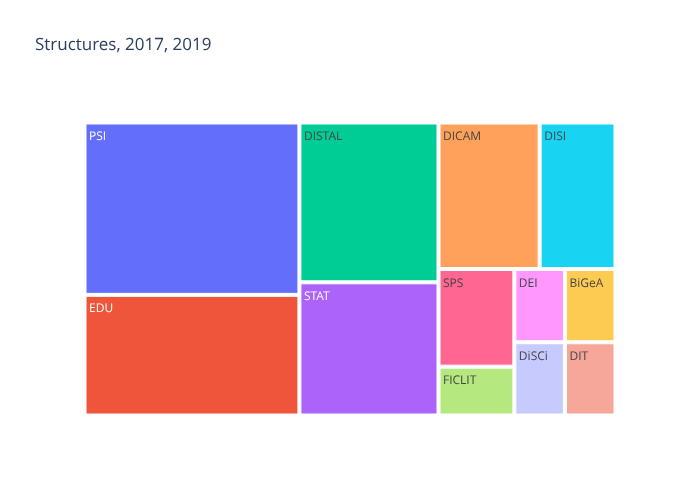

Scarica il file CSV: [structure_2017-2019.csv](structure_2017-2019.csv)

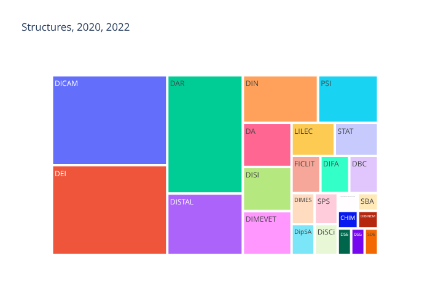

Scarica il file CSV: [structure_2020-2022.csv](structure_2020-2022.csv)

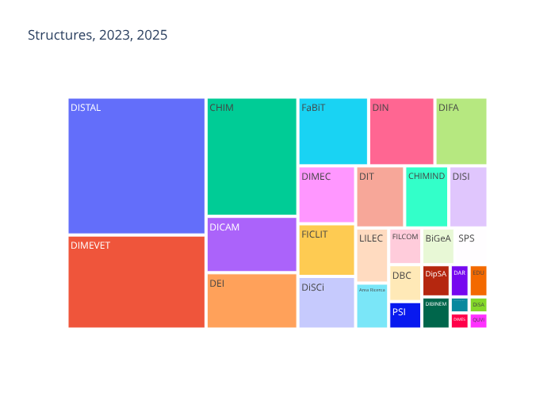

Scarica il file CSV: [structure_2023-2025.csv](structure_2023-2025.csv)

## Progetti

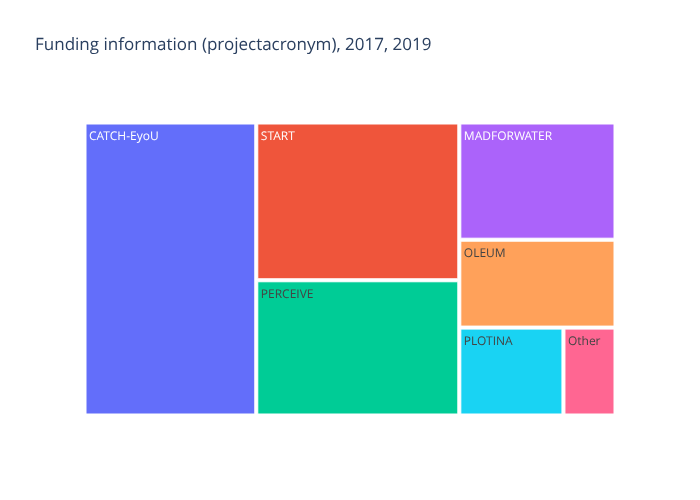

Scarica il file CSV: [projectacronym_2017-2019.csv](projectacronym_2017-2019.csv)

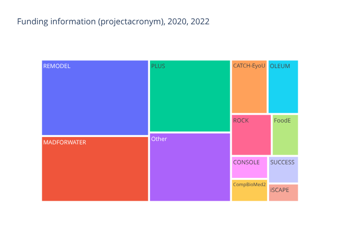

Scarica il file CSV: [projectacronym_2020-2022.csv](projectacronym_2020-2022.csv)

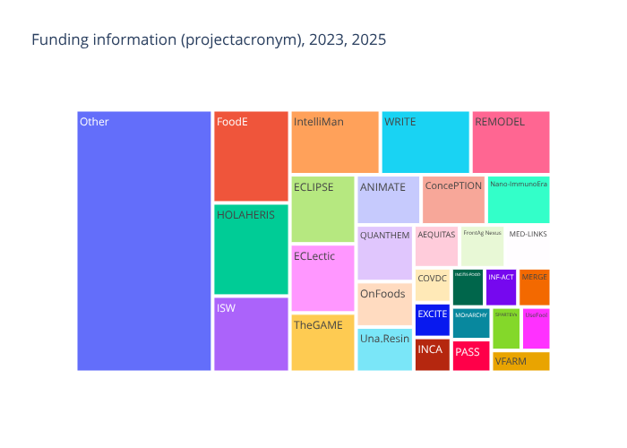

Scarica il file CSV: [projectacronym_2023-2025.csv](projectacronym_2023-2025.csv)

## Enti finanziatori

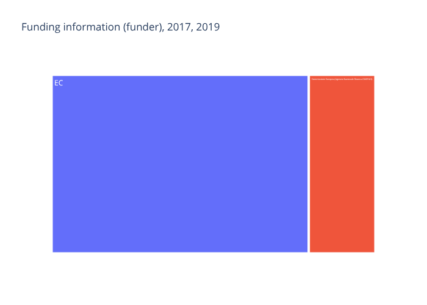

Scarica il file CSV: [funder_2017-2019.csv](funder_2017-2019.csv)

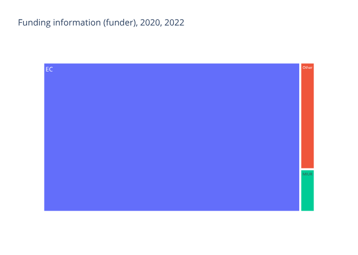

Scarica il file CSV: [funder_2020-2022.csv](funder_2020-2022.csv)

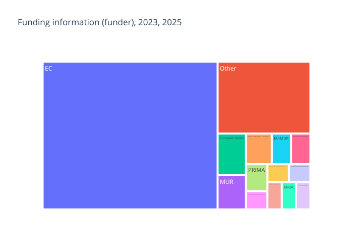

Scarica il file CSV: [funder_2023-2025.csv](funder_2023-2025.csv)

## Creatori

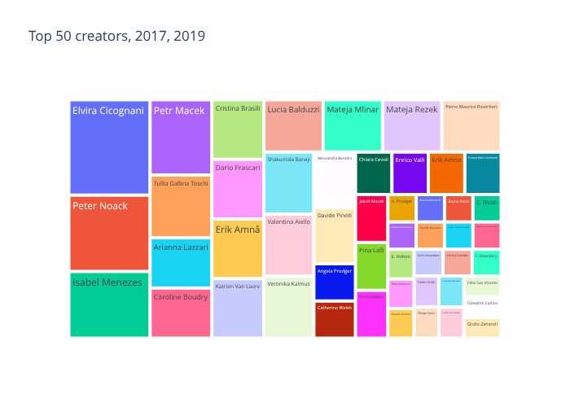

Scarica il file CSV: [top_50_creators_2017-2019.csv](top_50_creators_2017-2019.csv)

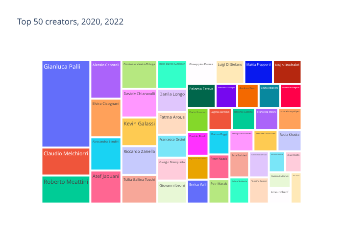

Scarica il file CSV: [top_50_creators_2020-2022.csv](top_50_creators_2020-2022.csv)

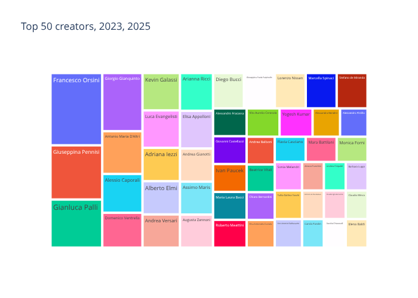

Scarica il file CSV: [top_50_creators_2023-2025.csv](top_50_creators_2023-2025.csv)
