## Documenti per tipologia

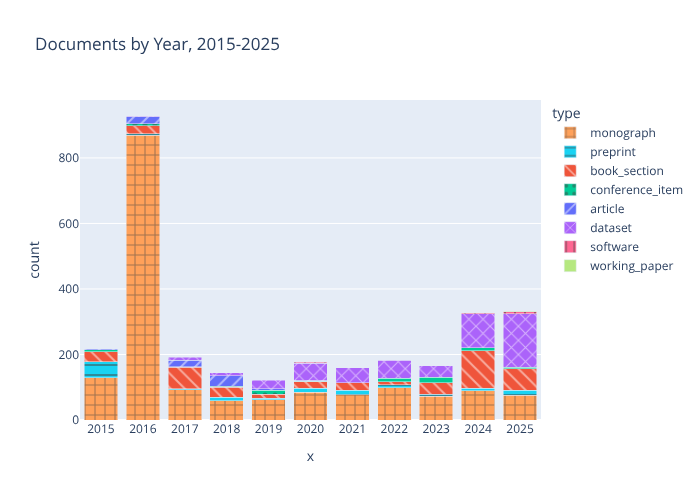

Scarica il file CSV: [out/documents_2015-2025.csv](out/documents_2015-2025.csv)

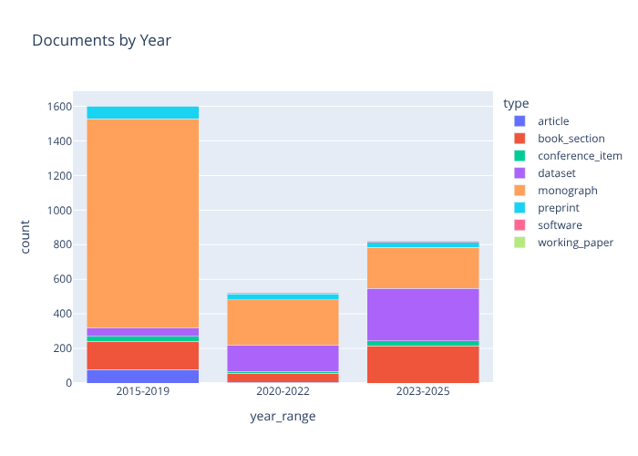

Scarica il file CSV: [out/documents_2015-2019_2020-2022_2023-2025.csv](out/documents_2015-2019_2020-2022_2023-2025.csv)

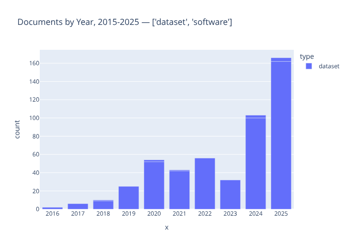

Scarica il file CSV: [out/documents_2015-2025_dataset_software_.csv](out/documents_2015-2025_dataset_software_.csv)

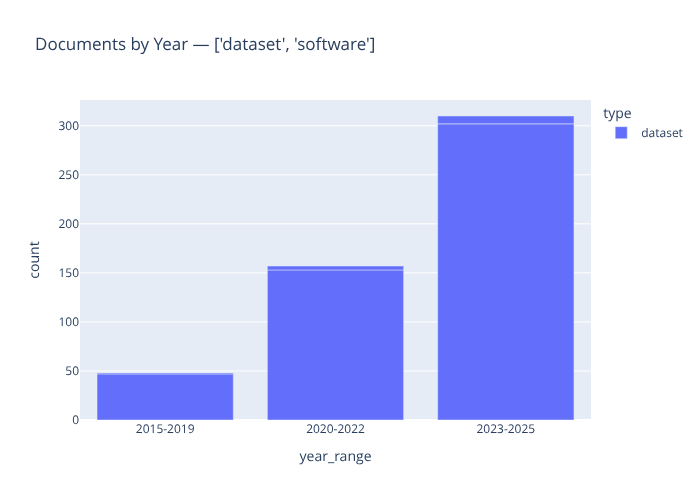

Scarica il file CSV: [out/documents_2015-2019_2020-2022_2023-2025_dataset_software_.csv](out/documents_2015-2019_2020-2022_2023-2025_dataset_software_.csv)

## Dataset con collegamento a pubblicazione

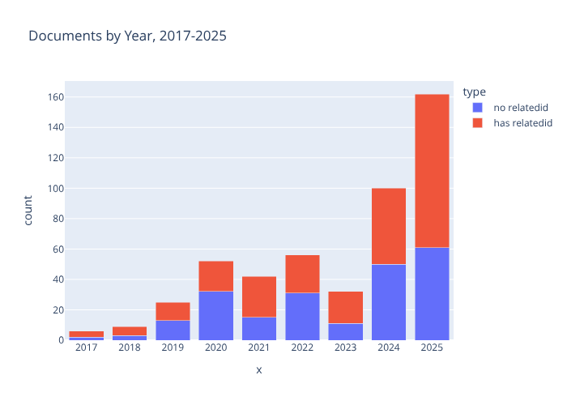

Scarica il file CSV: [out/relatedid_2017-2025.csv](out/relatedid_2017-2025.csv)

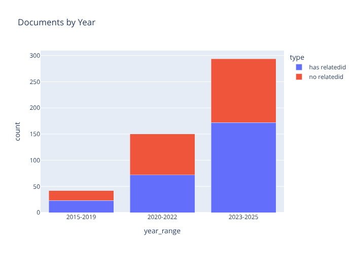

Scarica il file CSV: [out/relatedid_2015-2019_2020-2022_2023-2025.csv](out/relatedid_2015-2019_2020-2022_2023-2025.csv)

## Volume dei dataset

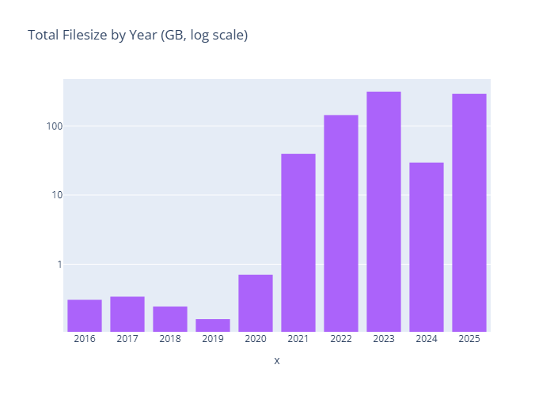

Scarica il file CSV: [out/sizes_2015-2025.csv](out/sizes_2015-2025.csv)

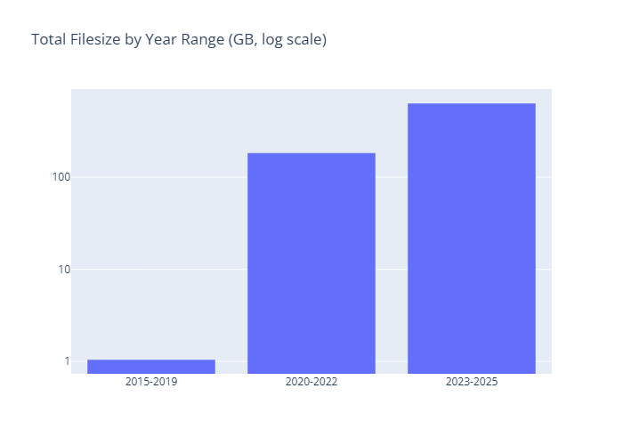

Scarica il file CSV: [out/sizes_2015-2019_2020-2022_2023-2025_.csv](out/sizes_2015-2019_2020-2022_2023-2025_.csv)

## Strutture

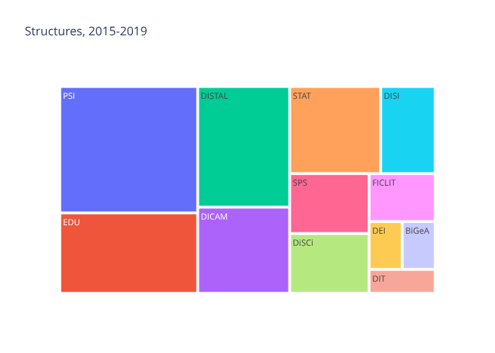

Scarica il file CSV: [out/structure_2015-2019.csv](out/structure_2015-2019.csv)

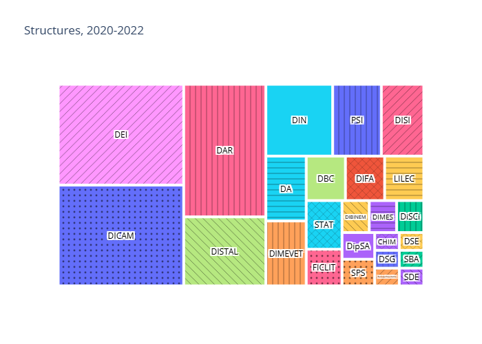

Scarica il file CSV: [out/structure_2020-2022.csv](out/structure_2020-2022.csv)

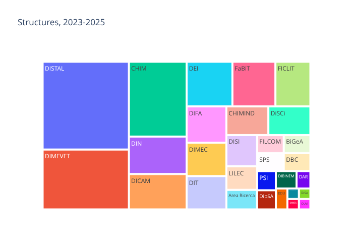

Scarica il file CSV: [out/structure_2023-2025.csv](out/structure_2023-2025.csv)
